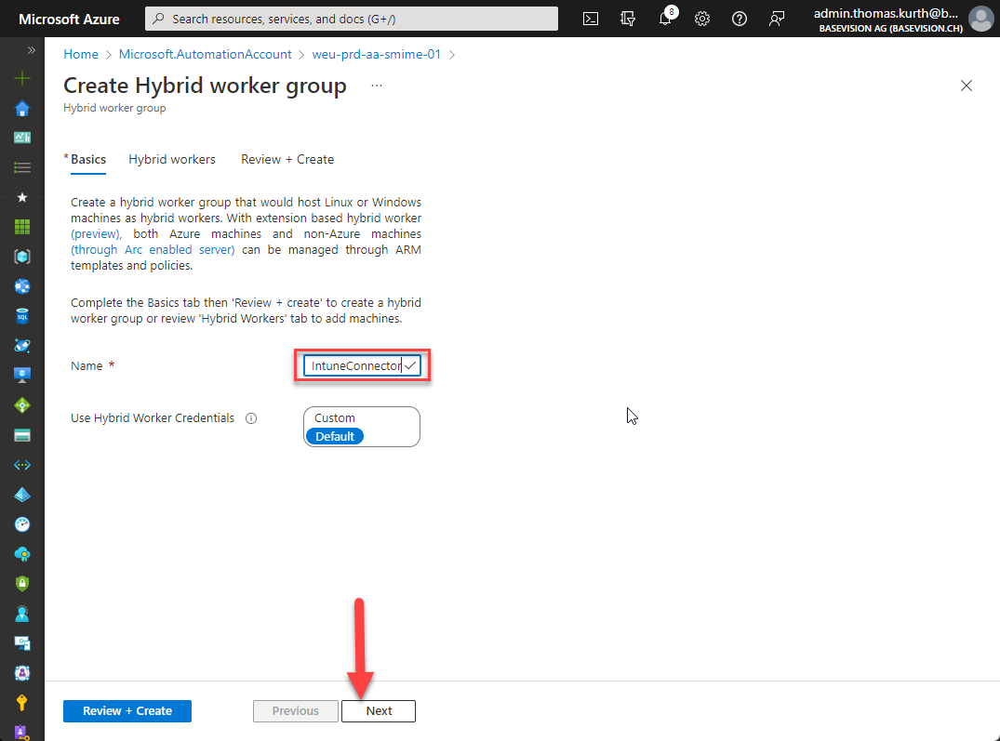

# Prepare your infrastructure

## Setup Azure VM in a new resource group

To execute the script we require Virtual Machine with the Intune certificate Connector installed. The creation of a virtual machine in azure should be a simple step, but I recommend to enable the following features to have the private keys stored securely:

- Enable TPM during setup
- Enable Only RDP and a public IP only when there are not internal routings available. If it is required, then we highly recommend enabling Just-In-Time-Access
- You can if you like join the VM to your domain and we recommend to think about how the VM will be managed in the future regarding Security Baselines and Updates.

### Install Intune Certificate Connector

Then you need to connect to the VM via RDP and install the Intune Certificate Connector.

1. Connect to the VM
2. Browse to <https://endpoint.microsoft.com> Tenant Admin Certificate Connectors
3. Click in Add to get the Download offered  
    
4. Download the connector  
    
5. Start installing the connector by agreeing to the T&C and click on install  
    
6. Choose “configure now” to start the configuration  
    
7. Select next  
    
8. Select “PKCS imported certificates” and click on next  
    
9. You can choose to use any Service Account but in normal cases we use the system account.  
    
10. Configure a Proxy if it is required within your environment.  
    
11. If all prerequisites are fulfilled click on next.  
    
12. Sign in with Intune Administrator or Global Administrator Credentials.
    
13. The connector is now fully configured and therefore you can click on Exit.  
    

### VM Manged Identity and Microsoft Graph Permissions

1. Enable System Managed Identity on the Azure Virtual Machine  
    
2. Grant the permissions via Script by executing the SetupAAD.ps1 script from the script repo. Specify the Object ID retrieved from the previous screen on the first line of the script.  
    

### Install PowerShell Modules

To execute the solution various PowerShell Modules should be preinstalled on the host and a Private/Public-Key needs to be created.

1. Copy the Setup.ps1 and the IntunePfxImport folder to the VM
2. Execute the setup.ps1  
    It will install all required modules and generate an encryption key which will then be used by the Intune Connector and the script.

Note: The IntunePfxImport Module is a ready to use build based on the Microsoft solution. Microsoft has not published this module to the PowerShellGallery and requires everybody to build with visual studio. To simplify this was done once for baseVISION. More Information in section “(Optional) Build IntunePfxImport Module” in the Appendix.

## Setup Azure Automation Account

We have now prepared the Virtual machine which will be used to execute the solution. Now we configure the solution to Automate and monitor the solution.

1. Create a new Azure Automation Account within your environment. We suggest using the same resource group like for the VM.  
    
2. You can unselect the “System assigned” identity as the one of the VM is used.  
    
3. The Azure Automation Account requires Internet Access and therefore in normal Case Public Access should be chosen.  
    
4. Assign Tags based on your requirements.  
    
5. Validate all settings and click on “create” when ready  
    
6. As soon the resource is created select “Go to resource” and switch to the Variables section and define the variables:
    1. Use the DigiCertApiKey and DigiCertOrgId collected in the previous section. As DigiCertProduct you can choose from the following list of types:

- client_premium - Premium
- client_digital_signature_plus - Digital Signature Plus
- client_authentication_plus - Authentication Plus
- client_email_security_plus - Email Security Plus
- class1_smime - Class 1 S/Mime Certificate

    Source: <https://dev.digicert.com/services-api/orders/order-client-certificate/>

    1. For the AADScopeGroupId retrieve the object id from a Azure AD group which defines the scope of the deployment and contains user accounts.
    2. The value of EnableSharedMailboxSupport depends on your requirements. If the user should also have the mail addresses of shared mailboxes where he has access on time of certificate request, then set it to true otherwise to false.  
        If you set the value to true then follow also the steps in the section Shared Mailbox Support.
    3. The TenantName should contain the .onmicrosoft.com name of your tenant

        

### Configure the created VM as Hybrid Worker

Now we have to provision the VM as a hybrid worker in our Azure Automation Account.

1. In the Azure Automation Account select “Hybrid Worker Groups” in the menu
2. Create a new group by providing a name for it. I use “IntuneConnector”  
    
3. Select “Add machines” on the next screen  
    
4. You can simply select the created VM. If you like to use an on-premises VM you have to follow the instructions, then follow Microsoft docs on how to setup them.
    
5. When the correct VM is selected choose “Review + Create” and start the creation when everything looks ok.
    

### Setup Runbook CertificateRequestor

Now we have to create the Runbook.

1. Start by selecting “Runbooks” within the console and click on “Create a runbook” to start the process.
2. Provide a name and select PowerShell as Runbook type and select 5.1 as runtime version.  
    
3. Copy the script from the repo to the content pane and then publish it.
    

### Enable Shared Mailbox Support (Optional)

In case users should receive a certificate, which includes the primary mailbox address of assigned shared mailboxes, then a few special configuration steps are required.

Configure a Run As Account for Azure Automation as the Exchange Online PowerShell module does not support managed identities.

1. Select “Run as accounts” in the menu and generate a “Azure Run As Account”  
    
2. Click on create
    
3. Now select the new account  
    
4. And copy the Object id as it is required to grant the permissions.
    
5. Then insert the Object Id in the “SetupExo.ps1” and execute the script with Global Admin permissions.
6. Then modify the “\$EnableSharedMailboxSupport” variable in the CertificateRequestor Runbook to \$true
7. Create an new Runbook to import the RunAsCertificate to the Hybrid Worker as [documented by Microsoft](https://docs.microsoft.com/en-us/azure/automation/automation-hrw-run-runbooks?tabs=sa-mi#runas-script).

## Exchange Online Configuration

DigiCert is sending a confirmation mail including the certificate to the user when the order is processed. This could be confusing for the user as he does not have the corresponding private key as it was generated on the hybrid worker.

Therefore, a transport rule could be used to block these messages.

1. Go to <https://admin.microsoft.com> and navigate to the Exchange Admin Center.  
    
2. Select “Mail Flow” and then “Rules”  
    
3. Create a new Rule  
    
4. And use the following values. In case you wish you could also forward the message to a specific mailbox instead of deleting the mails completely.  
    

## Test the implementation

1. Testing the implementation is an important step are there are many possibilities for mistakes.
2. Open the Runbook  
    
3. Select Edit  
    
4. Select “Test pane”  
    
5. Execute the script by selecting the correct hybrid worker group  
    
6. Follow the logs as defined in the appendix to troubleshoot issues if there are any. Keep in mind that one execution is required to create the order, then the user needs to validate the mail address and after that the next execution will upload the pfx to Intune.

## Enable Production Schedule

As soon the tests are successful you can create a schedule to execute the script as often as required.

1. Open the Runbook “CertificateRequestor”
2. Click on “Link to Schedule”  
    
3. Click on Schedule  
    
4. Add a new schedule or choose from an existing one if there is one  
    
5. Then we need to define the Run settings  
    
6. Select “Hybrid Worker” and the created hybrid worker group and click on ok  
    
