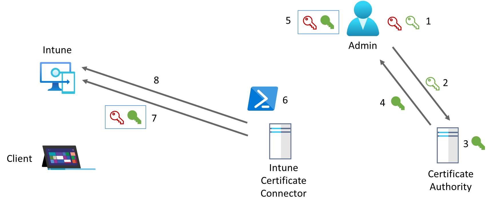
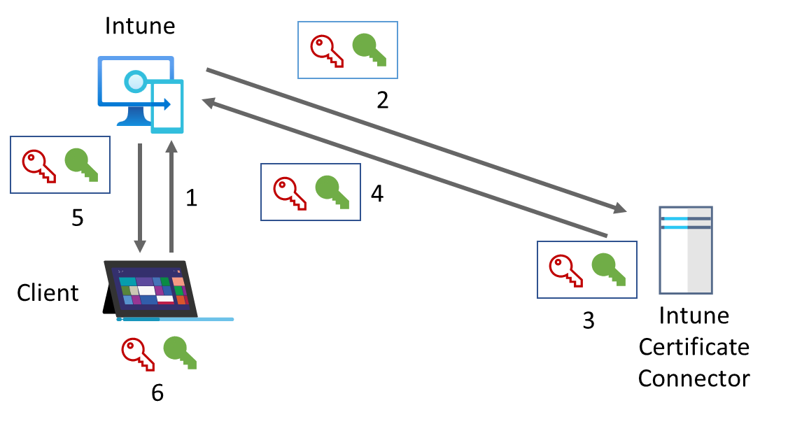

# Introduction

The following manual helps to configure fully automated deployment of imported PKCS certificates from Digicert Cert Central. The perfect solution for small and medium businesses. The Certificates are ordered via API and paid via credit card by default. Setting up a balance is also possible. The main goal is to deploy certificates for signing purposes and not for encryption as we are using Microsoft Pureview Information Protection for the encryption use case.

This repo is dedicated to the steps of the “Import Flow" but will also cover the deployment steps in the future.

But first I add some background information to provide the understanding how the process works:

## Process

### Import Flow

As we deploy pre created/imported certificates there is a special process used. With PKCS in general a PFX file(Public and Private Key) is required. In the import flow the PFX file is uploaded to Intune including the password for the file. But the password is encrypted with a key which is generated and stored in your virtual machine. With that Microsoft or somebody else can't use the PFX files but it requires some more work than just a normal PKCS flow. 

1. Admin creates key pair and certificate request

2. Admin sends Public Key with his identity to the CA PKCS\#10 / This can be any CA including Public one

3. The CA signs the Public key of the client with the CA private key. PKCS\#10

4. The CA returns the signed public key to NDES Service

5. Creating PFX file with self defined Password

6. PowerShell module Encrypt password of PFX cert with public key of encryption certificate
    - Get Public / Private key of encryption certificate (Could be hsm or Win Software key Storage Provider)
    - Build PowerShell module available on Github
    - \$userPFXObject = New-IntuneUserPfxCertificate -PathToPfxFile "\<FullPathToPFX\>" \$SecureFilePassword "\<UserUPN\>" "\<ProviderName\>" "\<KeyName\>" "\<IntendedPurpose\>" "\<PaddingScheme\>" "\<File path to public key file\>"

7. upload PFX file

8. upload encrypted password

### Deployment Flow

The deployment flow is used to provide the PFX file to the client including the password encrypted with the clients public key. For this re-encrypt the Intune Certificate Connector is used.

1. Request Policy

2. Intune requests Certificate connector
\-- Sends encrypted PFX password, PKCS\#12 certificate and devices public key

3. decryptes PFX password & reencrypts PFX password with device public key

4. Sends re-encrypted PFX password, PKCS\#12 certificate to intune

5. Device gets certificate via policy

6. Client decrypts certificate by using device management certificate

## Setup

All Scripts used in my manuals can be found in the SetupScripts or the AzureAutomation Folder.

1. [Setup DigiCert Account](SetupDigiCert.md)
2. [Prepare Infrastructure](PrepareInfrastructure.md)
3. Deploy Certificates to (Soon available)
    - Windows
    - iOS
    - Android
4. Configure Mail Clients (Soon available)

## Example User Flow

As soon you add users to the AAD Group specified in step “Setup Azure Automation Account” and the Runbook is executed a new certificate order will be placed.

On the hybrid worker you will find a reference to the pending order in the Program Data. The name of the file is the object id of the Azure AD User:

The user receives a Email Validation like:

When all mail addresses are validated, and the Runbook is executed again, then the order will be finished.

In case you would like to see which mail, addresses are not validated or cancel the order, then you can do this directly in Digicert CertCentral via “Certificate Actions”. If you cancel the order, then the file will be moved to the canceled folder on the VM and a new request will be placed.

### PFX Export User Flow

For non-MDM managed devices, it is possible to utilize the Send-PFXCertificate function to send the PFX to the user through mail.
To activate this function, you need to set the automation account variable "EnablePFXExport" to true and configure a mailbox in "PFXExportPasswordMailbox" to define, where the export password will be sent to.

When the certificate is issued, the user will receive the exported PFX certificate and the ExportPasswordMailbox will receive the corresponding password. Do NOT send this password through the mail channel but utilize a password manager or another communication channel to do so!

## Appendix

### Troublshooting – Delete Certificate from Intune to request new certificate from Digicert

In troubleshooting cases it’s sometimes helpful to be able to delete a certificate and request a new one. Keep in mind that this is associated with costs.

You can execute the RemoveCertificateFromIntune.ps1 script which will display a window to select the certificate which should be deleted.

### Troubleshooting – Log files

On the hybrid worker a log file per execution with detailed information is created.

It is also possible to have all logs including verbose/debug written to the Job log in Azure Automation which requires enabling it in the Azure Automation account. Errors are always logged in both places.

### (Optional) Build IntunePfxImport Module

Clone Git Repo [microsoft/Intune-Resource-Access: Sample code and scripts for interfacing with the Intune Resource Access APIs. (github.com)](https://github.com/Microsoft/Intune-Resource-Access)

