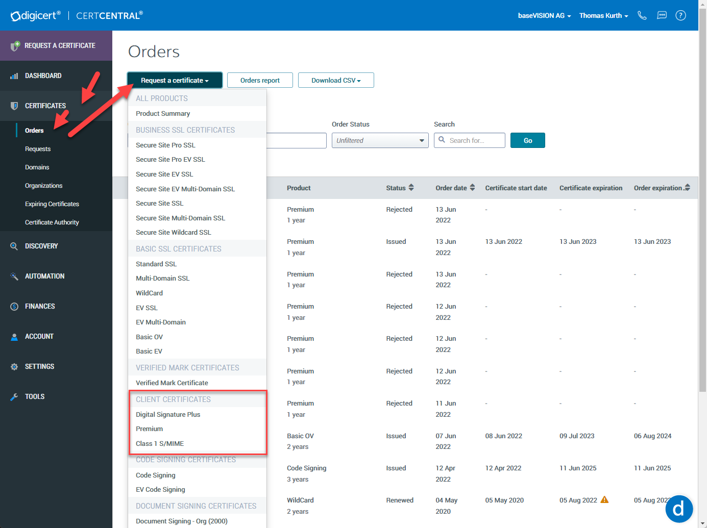
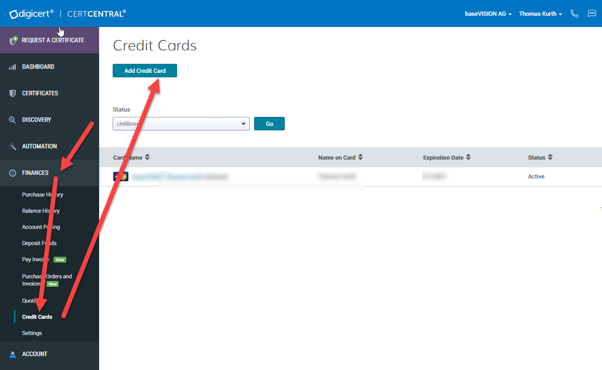
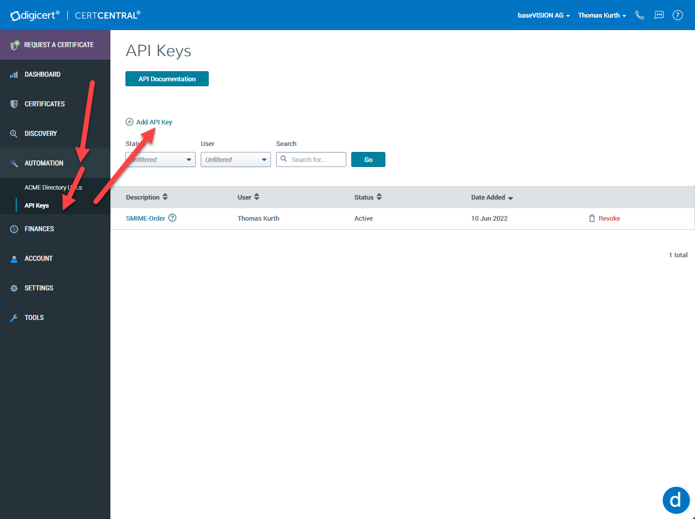
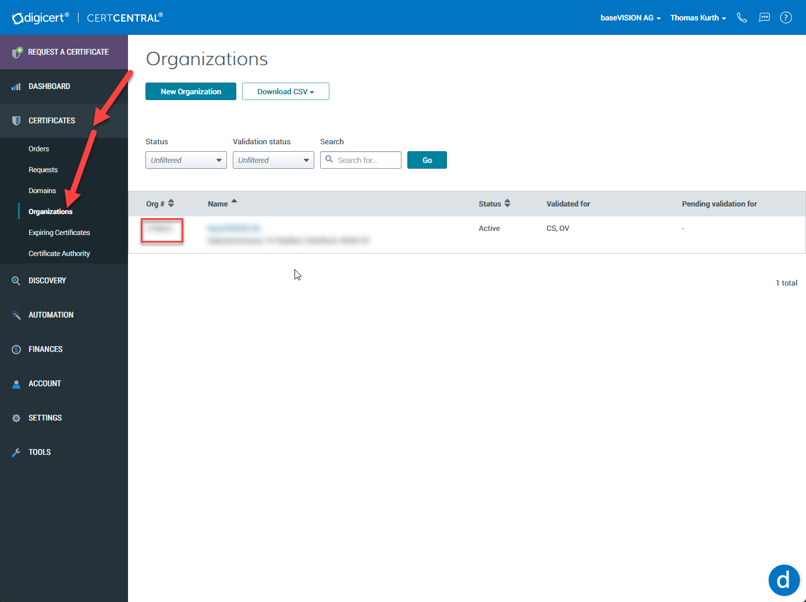

# Setup Digicert

It’s not simple to get the correct information from certificate providers on how to deploy SMIME certs. In general, the account teams do not seem to have knowledge about certificates or mdm deployment and reference to SSL certificates. But Digicert was able to help and therefore they were chosen for this implementation.

1. Setup Cert Central account setup.  
    [Sign up for your DigiCert account](https://www.digicert.com/account/signup/)
2. Then contact your Account manager and request, that they add the specific SMIME certificate products to your account. By default, only a small subset of their products can be ordered. If you need a lot of certificates, then you can also try to get discounts. Verify if you can see the products here:  
      

    By default we use a Premium template as it can be used also for document signing and authentication (VPN/Wifi). You could also choose another template by adjusting the script(Variable Definition).
3. Add a credit card as payment method. If you would like to use another method like balance or invoice you have to adjust the scripts and Cert Central Config.  
    
4. Create an API Key with a restriction to Orders. The key should be saved securely as we require it later
    
5. Make a note of the organization id which you would like to use.  
    

As Digicert is now configured, [continue with your infrastructure](PrepareInfrastructure.md).
